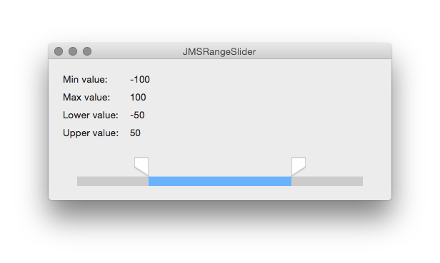

# JMS Range Slider v2.0.2

> A custom Range Slider for OSX



## Requirements
* OS 10.10+
* Swift 2

## Installation
#### CocoaPods
Add the following line to your `Podfile`:  
```
pod 'JMSRangeSlider'
```

#### Manual
Copy the folder `JMSRangeSlider` to your project

## [CHANGELOG](./CHANGELOG.md)

## EXAMPLE

```swift
let rangeSlider: JMSRangeSlider = JMSRangeSlider(frame: CGRectZero)
rangeSlider.direction = JMSRangeSliderDirection.Vertical
rangeSlider.cellsSide = JMSRangeSliderCellsSide.Left
rangeSlider.cellWidth = 20
rangeSlider.cellHeight = 30
rangeSlider.trackThickness = 10
rangeSlider.minValue = 0
rangeSlider.maxValue = 100
rangeSlider.lowerValue = 25
rangeSlider.upperValue = 75
rangeSlider.trackHighlightTintColor = NSColor(red: 0.4, green: 0.698, blue: 1.0, alpha: 1.0)
rangeSlider.frame = CGRect(x: 20.0, y: 20.0, width: self.bounds.width, height: 30.0)
rangeSlider.action = "updateRange:"
rangeSlider.target = self
self.addSubview(rangeSlider)

func updateRange(sender: AnyObject) {
    NSLog("Lower value = \(rangeSlider.lowerValue)")
    NSLog("Upper value = \(rangeSlider.upperValue)")
}
```

## PROPERTIES

#### `direction`
Direction of the slider ( Horizontal / Vertical )  
Type `JMSRangeSliderDirection`  
_Optional_  
Default: `JMSRangeSliderDirection.Horizontal`  

#### `cellsSide`  
Side of the cells ( Top / Bottom / Left / Right )  
Type `JMSRangeSliderCellsSide`  
_Optional_  
Default:  
`JMSRangeSliderCellsSide.Top` when `direction = JMSRangeSliderDirection.Horizontal`  
`JMSRangeSliderCellsSide.Left` when `direction = JMSRangeSliderDirection.Vertical`  

#### `cellWidth`  
Width of the cells  
Type `CGFloat`  
_Optional_  
Default: `20.0`  

#### `cellHeight`  
Height of the cells  
Type `CGFloat`  
_Optional_  
Default: `20.0`  

#### `minValue`  
Minimum value  
Type `Double`  
_Optional_  
Default: `0`  

#### `maxValue`  
Maximum value  
Type `Double`  
_Optional_  
Default: `1`  

#### `lowerValue`  
Initial lower value  
Type `Double`  
_Optional_  
Default: `0`  

#### `upperValue`  
Initial upper value  
Type `Double`  
_Optional_  
Default: `1`  

#### `trackTintColor`  
Tint color of track  
Type `NSColor`  
_Optional_  
Default: `rgba(0.8, 0.8, 0.8, 1)`  

#### `trackHighlightTintColor`  
Highlight tint color of track  
Type `NSColor`  
_Optional_  
Default: `rgba(0, 0, 0, 1)`  

#### `cellTintColor`  
Tint color of cells  
Type `NSColor`  
_Optional_  
Default: `white`  

#### `cornerRadius`  
Corner radius of cell  
Type `CGFloat`  
_Optional_  
Default: `1`  

## DEMO
There's a demo project in the repo

## LICENSE
MIT License
